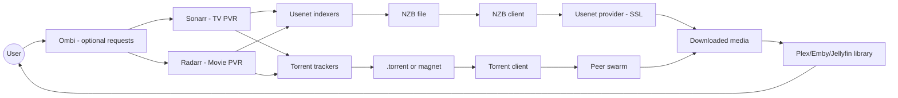
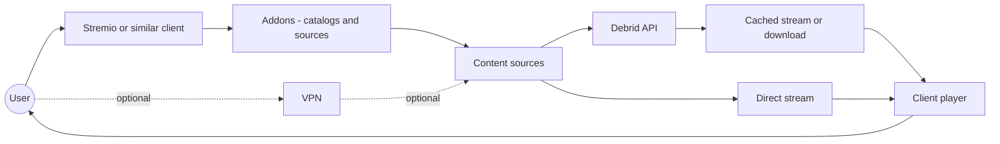
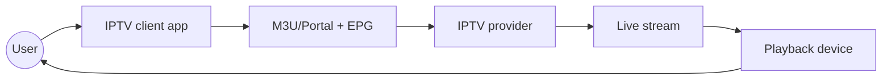
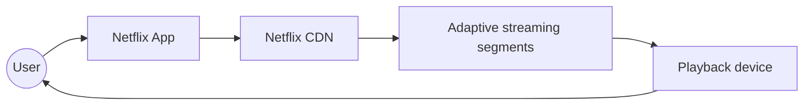

# Media Streaming Diagrams

Below are Mermaid diagrams that illustrate different Video Streaming Workflows.

## Self-Hosted Library (Usenet/Torrent)

## Addon-Based Streaming

## IPTV

## Subscription Streaming Services

## Pros and Cons by Workflow

| Workflow                             | Sample Apps                         | Pros                                               | Cons                                            |
|--------------------------------------|-------------------------------------|----------------------------------------------------|-------------------------------------------------|
| Self-Hosted Library (Usenet/Torrent) | Plex, Emby, Jellyfin                | Full library control; automation friendly          | More services and setup; storage required       |
| Addon-Based Streaming                | Stremio, P-Stream, PlayTorrio       | Simple app UX; broad catalogs; fast cached streams | Addon churn; third-party risk; uneven metadata  |
| IPTV                                 | IPTV Smarters, VLC                  | Live channels; simple client setup                 | Provider quality varies; unstable lineups       |
| Subscription Streaming Services      | Netflix, Disney+, Prime Video, etc. | Stable quality; easy setup; consistent UX          | Region-locked catalog; ongoing cost; DRM limits |
