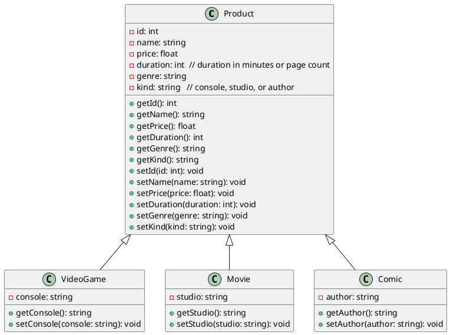
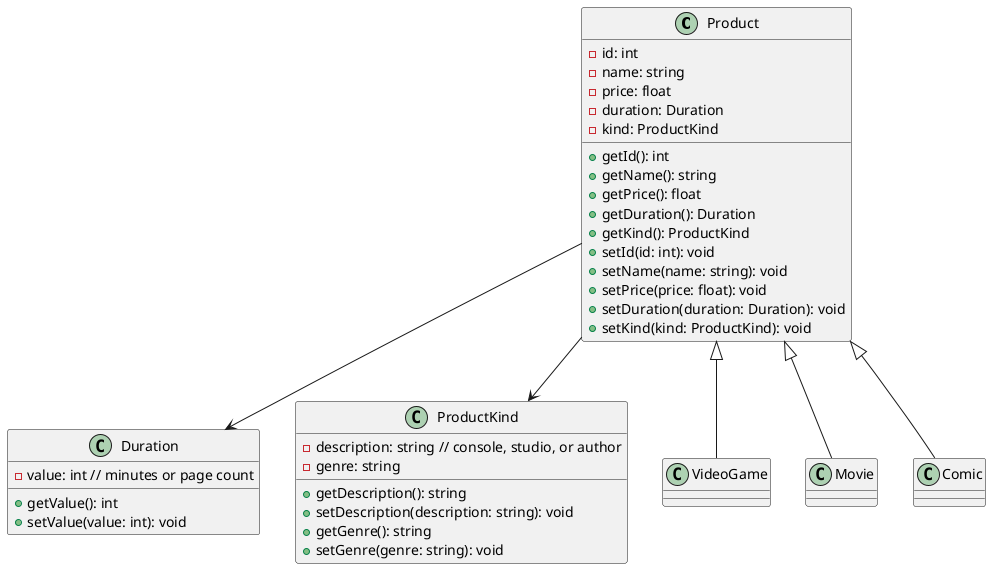

Modeling a digital store that sells three product types: video games, movies, and comics. Two diagram variants show the evolution from simple inheritance to a design that extracts shared metadata into composed value objects.

## Simple inheritance

Three classes inheriting from a single `Product` base.

## With composed metadata

`Duration` and `ProductKind` become their own classes referenced by `Product` via composition.

