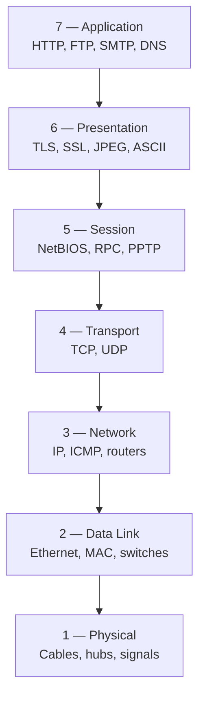
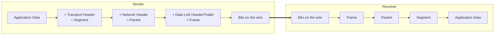
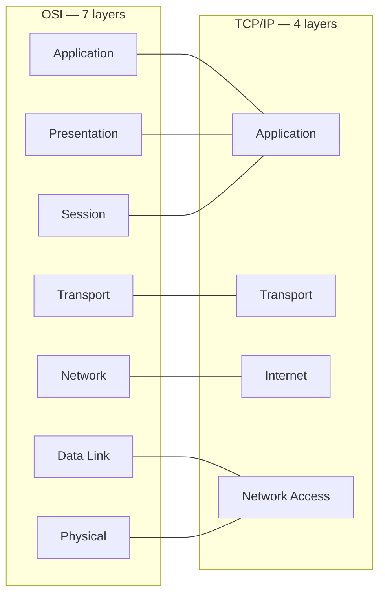

The **Open Systems Interconnection (OSI) model** is a conceptual framework that standardizes the functions of a telecommunication or computing system into seven abstraction layers. Each layer serves the one above it and is served by the one below.

## The Seven Layers

## Layer Summary

| #   | Layer        | Unit (PDU) | Responsibility                                    | Examples                       |
| --- | ------------ | ---------- | ------------------------------------------------- | ------------------------------ |
| 7   | Application  | Data       | Interface with end-user applications              | HTTP, FTP, SMTP, DNS, SSH      |
| 6   | Presentation | Data       | Translation, encryption, compression              | TLS/SSL, JPEG, MPEG, ASCII     |
| 5   | Session      | Data       | Establish, manage, terminate sessions             | NetBIOS, RPC, PPTP             |
| 4   | Transport    | Segment    | Reliable delivery, flow control, segmentation     | TCP, UDP                       |
| 3   | Network      | Packet     | Logical addressing and routing between networks   | IP, ICMP, IPSec, routers       |
| 2   | Data Link    | Frame      | Node-to-node delivery, MAC addressing, error det. | Ethernet, PPP, switches, NICs  |
| 1   | Physical     | Bit        | Raw bit transmission over physical medium         | Cables, fiber, hubs, repeaters |

## Encapsulation Flow

When data is sent, each layer adds its own header (and sometimes trailer) — a process called **encapsulation**. The receiver reverses it (**decapsulation**).

## OSI vs TCP/IP

The TCP/IP model is the one actually used on the Internet. It collapses several OSI layers.

## Mnemonics

To memorize the layers (top → bottom):

- **A**ll **P**eople **S**eem **T**o **N**eed **D**ata **P**rocessing
- Or bottom → top: **P**lease **D**o **N**ot **T**hrow **S**ausage **P**izza **A**way

## References

- [OSI Model — osi-model.com](https://osi-model.com/)
- [OSI Model (Wikipedia)](https://en.wikipedia.org/wiki/OSI_model)
- [ISO/IEC 7498-1 Standard](https://www.iso.org/standard/20269.html)
