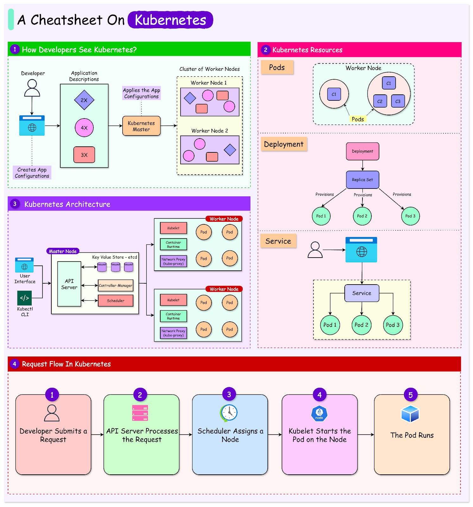

Kubernetes is a container orchestration platform that automates deployment, management, and scaling of containerized applications.

## Main Components

- **Pods**: Smallest Kubernetes unit, containing one or more containers.
- **Deployments**: Manage Pods and rolling updates.
- **Services**: Expose applications inside or outside the cluster.
- **Namespaces**: Segment resources within the cluster.

## Related Tools

- **kubectl**: Command-line tool to interact with Kubernetes.
- **Minikube**: Tool to run Kubernetes locally.
- **Docker + Kubernetes**: Common pairing for local workflows and deployment pipelines.

## Basic kubectl Commands

```sh
kubectl get pods            # List running pods
kubectl create -f app.yaml  # Create resources from a YAML file
kubectl delete pod my-pod   # Delete a specific pod
kubectl apply -f app.yaml   # Apply changes to a configuration
```



## Additional Resources

- [Kubernetes Official Documentation](https://kubernetes.io/docs/)
