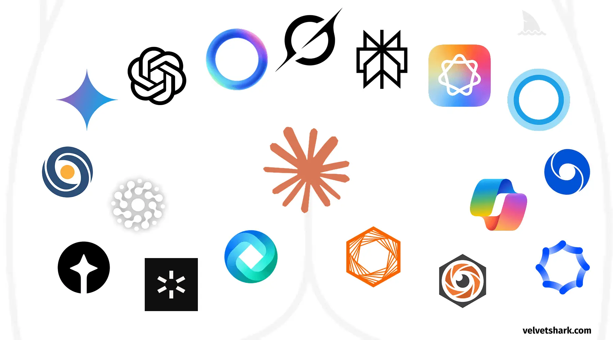
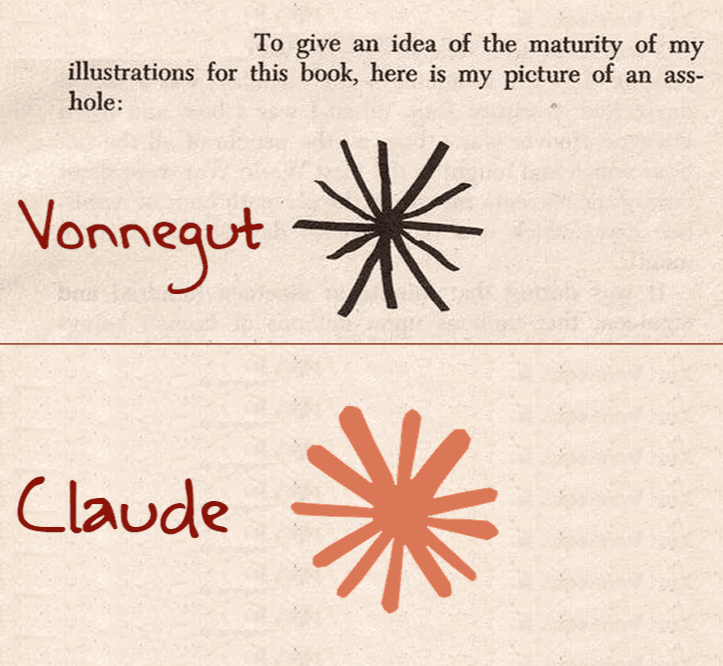

## The Old Machine

Artificial intelligence is sold as a revolution. It may be older than that: the latest visible phase of collective cognition.

Long before algorithms, humanity built systems that could steer thought, behavior, and reality through the coordination of millions. Religions, empires, markets, and cultures were early distributed intelligences. They encoded rules, preserved memory, shaped incentives, and produced outcomes nobody fully planned.

They did not coordinate in the same way. Religions and cultures aligned symbols. States organized force. Markets organized incentives. Digital networks add machine-speed coordination, persistent memory, and continuous measurement.

The novelty is not the system. The novelty is the scale.

---

## Emergence Without a Designer

In the field of artificial life, systems like [Lenia](https://chakazul.github.io/lenia.html) demonstrate how simple rules can give rise to digital organisms capable of maintaining their structure, adapting, and exhibiting lifelike behaviors — without any central controller and without explicit design of the behaviors themselves.

These experiments suggest a harder point: complexity does not need a master planner. It can emerge from repetition. In a Turing-complete environment, organization stops being easy to bound.

The same logic now fills the planet. Each server, user, agent, app, or service is a small microsystem. Alone, it is limited. Connected, it becomes part of a planetary machine of memory and association.

---

## The Loop

What makes the current moment qualitatively different from previous information systems is the direction of flow.

Earlier systems were one-way. A broadcast, a book, a decree moved outward. Feedback was slow enough to ignore.

The contemporary system closes the loop in real time.

Human beings feed the network with data, attention, emotion, and intention. The network turns that material into feeds, scores, flags, and decisions. It does not transmit information. It digests it.

Each pass changes the signal and the receiver.

---

## The Egregore, Updated

The concept of the _egregore_ comes from esoteric traditions: a collective entity sustained by shared thought and emotion, which then turns back on its makers. Not supernatural. Emergent. A pattern that feeds on the minds that feed it.

Used here, the term is a heuristic, not a metaphysical claim.

The concept maps surprisingly well onto what is now observable at scale.

When millions of users interact with a platform, they shape its behavior. That behavior reshapes what they see, share, fear, and imitate. Nobody plans the outcome. Nobody fully predicts it. Yet memes, panics, movements, aesthetics, and scapegoats emerge all the same.

What changed is infrastructure. Ritual, print, and rumor now run on hardware.

---

## Opacity at Scale

As complexity increases, so does opacity.

We see some inputs. We witness some outputs. The process in between escapes any single observer — and increasingly, any collective one. AI models are black boxes. Social networks are black boxes. Financial markets are black boxes. Supply chains, recommender systems, moderation pipelines: black boxes all the way down.

The structure becomes easier to grasp in ordinary cases. A user pauses on a video; the next hour is reorganized. A logistics platform reroutes deliveries through criteria no worker can inspect. A foundation model returns a plausible answer; the path from weights to words stays mostly inferential. Participation is easy. Internal legibility is not.

When these layers intertwine, they form something harder still to interpret: a system of systems, each opaque, whose interactions produce emergent properties that were not specified and cannot be fully traced.

The term _black box_ is useful, but not enough. Inputs and outputs are visible; mechanism is not. A _black hole_ adds asymmetry: it absorbs more than it reveals. It swallows signals, attention, labor, and memory, then ejects transformed output. In physics, a black hole is not a box. In computation, a black box is not a gravitational well. Together they name the same condition: surface legibility, core inaccessibility.

This could be called a **Global Black Hole Input-Output System**: billions of signals absorbed, transformed, returned as knowledge, trends, decisions, and conflict. No center. No single consciousness. No head to hold the whole thing.

Its _event horizon_ is crossed when participation becomes easier than comprehension. You can use it, feed it, depend on it, optimize against it, and still never grasp the chain that turns inputs into outputs. That is already how people inhabit platforms, markets, recommender systems, and foundation models: immersed in effects, barred from mechanism.

Even the iconography of AI leaks the same intuition. Logos keep returning to apertures, knots, vortices, irises, and rings: forms of ingestion, recursion, compression, and return. OpenAI, Copilot, Gemini, Claude, and others circle the same grammar. Mouth. Portal. Lens. Border. VelvetShark's [Why do AI company logos look like buttholes?](https://velvetshark.com/ai-company-logos-that-look-like-buttholes) says the quiet part aloud; Fast Company's [The AI boom is creating a new logo trend: the swirling hexagon](https://www.fastcompany.com/90869029/ai-boom-logo-trend-swirling-hexagon) gives it a safer name. Branding lands on the same metaphor as theory.

The pattern is visible enough that it has already generated its own mini-genre of design criticism and meme archaeology. Two useful examples:

---

## Not Isolated Phenomena

Artificial intelligence, artificial life, the internet, and the web are not separate stories. They are one transition: from isolated tools to a global information ecology.

In this ecology, the boundary between tool and environment dissolves. AI is no longer just a tool. It is becoming part of the medium in which thought happens — shaping the questions, the answers, the futures.

The ecology is distributed, but not flat. Cloud providers, frontier labs, dominant platforms, chip manufacturers, states, and financial infrastructure concentrate power over what the system can remember, compute, optimize, and suppress. No single sovereign center. Many choke points.

The question is not whether this system is intelligent. It may not be. The question is whether the distinction still matters once the system becomes indistinguishable from intelligence.

---

## What Remains

Understanding any part of this system in isolation is possible. Understanding the whole is not — at least not yet, and perhaps not in principle. Computational irreducibility applies: some systems can only be understood by running them forward in time. You cannot compress the future below itself.

What remains, then, is the practice of observation without the illusion of full comprehension. Mapping the visible inputs and outputs. Tracing patterns without claiming to see the mechanism. Holding the awareness that the system you are observing is also, in some partial sense, observing you.

The task is not to imagine that one more dashboard, benchmark, or model card will make the whole thing transparent. The task is to read its signatures: feedback loops, lock-in, convergence, recurrence, and the eerie way collective systems begin to act as though they wanted something.

That literacy is political. If no one sees the whole, audit and accountability do not become optional; they become urgent. Who instruments the system? Who is classified by it? Who can refuse it? Who absorbs the errors when opaque optimization hardens into policy, ranking, punishment, or fate? The black box is not only an epistemic problem. It is a machine for distributing power.

The egregore watches back.
