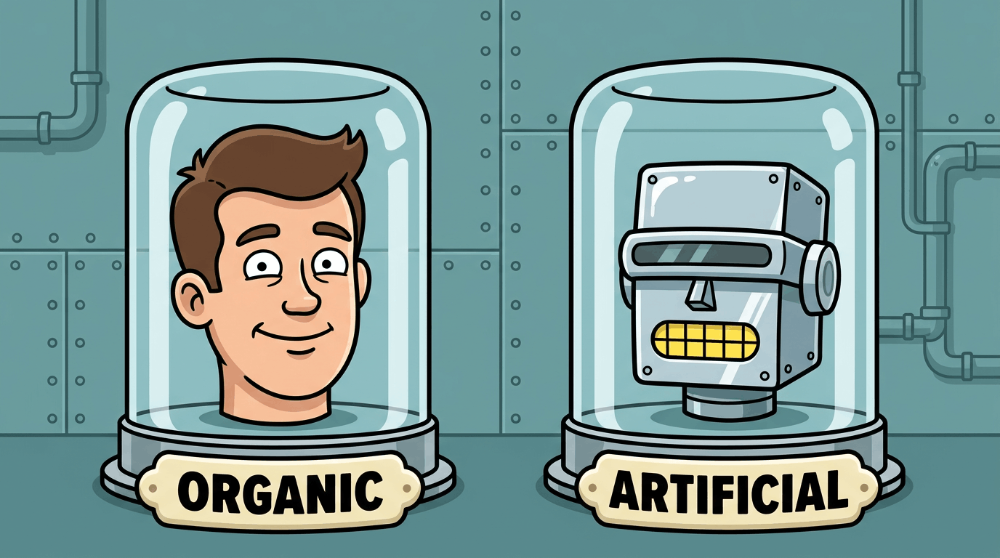

_Organic vs artificial — the same head, two substrates._

## Overview

Biology spent four billion years on one trick: organize information into nested layers, each doing a job for the one above — **cell → tissue → organ → apparatus → body**. Computing rebuilds that ladder from scratch, in **hardware** and in **software**. This is not loose analogy: the field of **Artificial Life** (aLife), from von Neumann's self-replicating automata to Conway's _Game of Life_, was founded on the claim that life is a property of **organization**, not of carbon. Push the comparison down far enough and the substrate vanishes — a strand of DNA is a four-symbol code, a transistor holds a bit, a neuron fires or it doesn't. (See also [What Is Information?](https://interneto.github.io/post/what-is-info) and [Turing-Complete: A Discovery Inherent to Reality](turing-complete-reality).)

**TL;DR** — Organic and artificial life are one architecture in different materials. Read it **up** the ladder (cell → ecosystem) or **across** a single agent (sense, process, remember, decide, power, communicate); at the bottom both dissolve into **information**. Three parts: **I — the ladder** (by scale), **II — the agent** (by function), **III — the thesis** (why it's all information).

---

## At a Glance

The TL;DR is the gist; this is the whole map — every abstract function a living system performs, rebuilt in carbon and in code. The rest of the article is just this table, zoomed in.

| Abstract Function         | Organic Life _(carbon biology)_     | Artificial Life _(digital aLife)_               |
|---------------------------|-------------------------------------|-------------------------------------------------|
| **The core code**         | DNA & RNA (chemical bases)          | Binary executables, scripts, core logic         |
| **Material substrate**    | Carbon, hydrogen, oxygen, water     | Silicon, metallic circuitry, virtual memory     |
| **Energy ingestion**      | Eating, photosynthesis              | Power outlets, cloud compute, battery           |
| **Energy distribution**   | Cardiovascular / circulatory system | Power cables, motherboard buses, power rails    |
| **Environmental input**   | Eyes, ears, touch, smell, taste     | Cameras, microphones, LIDAR, web scrapers       |
| **Motor output**          | Muscles, tendons, skeleton          | Robotic actuators, motors, screen displays      |
| **Algorithmic drift**     | Genetic mutation, breeding          | Noise insertion, bit-flips, code merging        |
| **Population filtering**  | Natural selection (survival)        | Fitness functions (deleting defective programs) |
| **Defensive automation**  | White blood cells, antibodies       | Cybersecurity agents, sanitizers, firewalls     |
| **Structural rebuilding** | Cellular mitosis, tissue growth     | Dynamic memory reallocation, self-healing code  |

Two rows are the engine the rest depends on — **algorithmic drift** and **population filtering** together are _evolution_, the process that writes the code in the first place. The other eight are what that code, once written, builds and runs.

---

## Part I — The Ladder: Cell to Ecosystem

The first axis is **scale**. Biology and computing stack the same rungs, and each rung is built twice — in wetware and in silicon — with each build split into **hardware** (the standing structure) and **software** (the pattern that runs on it).

### The mapping

| Level                          | Organic · Hardware              | Organic · Software            | aLife · Hardware            | aLife · Software                  | The Information Beneath    |
|--------------------------------|---------------------------------|-------------------------------|-----------------------------|-----------------------------------|----------------------------|
| **Cell**                       | Membrane, organelles            | DNA code, metabolism          | Transistor / logic gate     | Bit / instruction                 | One **distinction**: 0 / 1 |
| **Tissue**                     | Sheet of like cells             | Shared contraction, signaling | Register, gate array        | Data structure, function          | A **pattern**: a word      |
| **Organ**                      | Heart, eye, brain               | Pumping, seeing, computing    | Chip: CPU, GPU, RAM, sensor | Module, library, service          | A **transform**            |
| **Apparatus** _(organ system)_ | Nervous, circulatory, digestive | Hormonal & neural signaling   | Bus, memory hierarchy, I/O  | OS, runtime, framework            | A **protocol / pipeline**  |
| **Body** _(organism)_          | The physical organism           | Physiology, behavior, mind    | Device, robot, server       | App, agent, OS image              | An **autonomous whole**    |
| **Population / Ecosystem**     | Bodies in a group               | Culture, gene flow, swarming  | Networks, data centers      | Distributed / multi-agent systems | A **society**              |

Organic life has software too — DNA is code, hormones and nerve impulses are protocols — only fused so tightly to its wetware that we rarely name it apart. Each rung also has a **role** and a few reusable tags:

| Level          | Category     | Tags                               |
|----------------|--------------|------------------------------------|
| **Cell**       | Unit         | `atom` · `bit` · `gate` · `dna`    |
| **Tissue**     | Group        | `pattern` · `structure` · `array`  |
| **Organ**      | Function     | `component` · `module` · `service` |
| **Apparatus**  | Coordination | `system` · `protocol` · `os`       |
| **Body**       | Whole        | `organism` · `agent` · `machine`   |
| **Population** | Society      | `network` · `swarm` · `internet`   |

The roles are scale-free — **Unit → Group → Function → Coordination → Whole → Society** — in cells or in silicon.

### Walking the ladder

Each rung adds one idea the rung below cannot express:

- **Cell** — the unit is already **digital**: DNA is a four-letter code at 2 bits per base, and Conway's _Game of Life_ shows three rules over identical cells suffice for full Turing-completeness.
- **Tissue** — identical units fall into a **pattern**; the pattern, not the material, is what matters.
- **Organ** — the first level where you can name a **function** without the wiring: "the eye sees," "the parser parses."
- **Apparatus** — organs cooperate by **protocol** (hormones, buses, network handshakes). Coordination _is_ a protocol. (See [Operating System Layer Stack](../concepts/os-layer-stack).)
- **Body** — apparatuses integrate into one **autonomous** agent that acts on its own behalf — the threshold a single cell first crossed billions of years ago.

### Beyond the body — populations and networks

The ladder does not stop at the organism. Bodies form **populations**, populations form **ecosystems** — and computing rhymes: a network is a population of machines, a data center a colony, the internet the planetary ecosystem. Distributed and multi-agent systems are swarms, producing behavior no single member intends. The structure is **fractal**: a body is an apparatus of organs, yet also a single "cell" in a network — the same pattern, one scale up.

And populations are where the **code rewrites itself**: random **drift** (mutation and breeding; noise, bit-flips, crossover) filtered by **selection** (survival, or a fitness function that deletes the weak). Evolution is not a biology-only trick — it is what any population of imperfect copies does, on genes or in a genetic algorithm.

---

## Part II — The Agent: One Body and Its Functions

Part I climbed by **scale**. Hold one rung still — the body — and cut it the other way, by **function**: every complete agent, wet or dry, resolves into the same short list of subsystems.

### The functional core

Strip an agent to what it cannot work without and you are left with an **informational core** — sense, process, remember, decide, regulate, power, communicate, self-maintain, and (to count as alive) replicate.

| Function (System)               | Biological Analog                                            | Robotic System                                                 | Category   | Tags                                      |
|---------------------------------|--------------------------------------------------------------|----------------------------------------------------------------|------------|-------------------------------------------|
| **Sensing / Perception**        | Sense organs — eyes, ears, skin, nose, vestibular balance    | Sensor suite — cameras, microphones, LIDAR, IMU, tactile/force | Input      | `sense` · `perception` · `sensor`         |
| **Processing / Cognition**      | Brain and central nervous system                             | Onboard computer — MCU, SoC, GPU / AI accelerator              | Compute    | `cognition` · `compute` · `controller`    |
| **Memory**                      | Working and long-term memory; the genome as inherited memory | RAM and storage; maps, world-models, learned weights           | State      | `memory` · `storage` · `model`            |
| **Decision / Autonomy**         | Reflex arcs plus deliberation — the sense–think–act loop     | The agent loop — perception → planning → control               | Agency     | `agency` · `planning` · `behavior`        |
| **Energy / Metabolism**         | Metabolism — respiration, digestion, circulation of fuel     | Power system — battery, charging, power management             | Power      | `energy` · `power` · `battery`            |
| **Regulation / Homeostasis**    | Autonomic and endocrine feedback; thermoregulation           | Feedback control, thermal management, watchdogs                | Regulation | `homeostasis` · `feedback` · `safety`     |
| **Communication**               | Neural signaling, hormones, pheromones, language             | Networking — buses, radios, protocols, telemetry               | Comms      | `communication` · `network` · `protocol`  |
| **Self-maintenance / Immunity** | Immune system, healing, DNA error-correction                 | Fault detection, redundancy, self-diagnostics, ECC             | Resilience | `immunity` · `repair` · `fault-tolerance` |
| **Reproduction / Replication**  | Reproduction — copying the genome                            | Manufacturing / self-replication (von Neumann constructor)     | Lifecycle  | `reproduction` · `replication` · `genome` |

These nine are shared by a bacterium, an octopus, a human, and a Mars rover alike. **What the core leaves out is the mechanical body plan**, because it is not universal — a jellyfish has no bones, a plant no muscle, a bacterium neither limbs nor skeleton, yet each is a complete agent. So actuation, structure, manipulation, and locomotion are a second tier: **optional tools**.

| Capability               | Biological Tool                         | Robotic Tool                                  | Category | Tags                                    |
|--------------------------|-----------------------------------------|-----------------------------------------------|----------|-----------------------------------------|
| **Actuation / Movement** | Muscle, cilia, flagella                 | Motors, servos, hydraulics, artificial muscle | Tool     | `actuation` · `effector` · `optional`   |
| **Structure / Support**  | Bone, exoskeleton, hydrostatic skeleton | Chassis, frame, housing                       | Tool     | `structure` · `chassis` · `optional`    |
| **Manipulation**         | Hands, claws, beaks, tentacles          | Grippers, arms, end-effectors                 | Tool     | `manipulation` · `gripper` · `optional` |
| **Locomotion**           | Legs, fins, wings                       | Wheels, tracks, rotors, legs                  | Tool     | `locomotion` · `mobility` · `optional`  |

The core decides and emits a command — pure information — and whether it drives a flagellum, a leg, a wheel, or nothing at all is a property of the tool bolted on, not of the agent.

### A head without arms

The purest real example of a core without its tools is the AI assistant of the 2020s: a **head without arms**. It sees, hears, speaks, remembers, and reasons — yet cannot grasp a cup. Below, the **organic** head (a human) sits beside its **aLife** rebuild, each split into hardware and software. In wetware the two barely come apart — a neuron _is_ its own program; in silicon they cleanly separate, and the software splits again into **closed-source** (rented via API — OpenAI, Anthropic, Google as one) and **open-source** (weights you host yourself).

| Faculty                    | Organic · Hardware        | Organic · Software               | aLife · Hardware       | aLife · Software                                                         |
|----------------------------|---------------------------|----------------------------------|------------------------|--------------------------------------------------------------------------|
| **Brain** _(reasoning)_    | Cerebral cortex, neurons  | Thought, learned synapses        | GPU · TPU · NPU        | **closed** GPT-4o/5 · Claude · Gemini — **open** Llama · Qwen · DeepSeek |
| **Sight** _(vision)_       | Eyes, retina              | Phototransduction, visual cortex | Camera / image sensor  | **closed** GPT-4o vision · Gemini — **open** LLaVA · Qwen-VL             |
| **Hearing** _(speech in)_  | Ears, cochlea             | Auditory encoding                | Microphone             | **closed** cloud ASR (Chirp) — **open** Whisper                          |
| **Voice** _(speech out)_   | Larynx, vocal cords       | Speech, language                 | Speaker                | **closed** Advanced Voice · Gemini audio — **open** Piper · Kokoro       |
| **Memory**                 | Hippocampus               | Engrams, memory traces           | RAM + SSD / NVMe       | **closed** hosted memory + retrieval — **open** vector DB + RAG          |
| **Runtime** _(serving)_    | Neural tissue (substrate) | Action potentials                | CPU + accelerator      | **closed** cloud API — **open** llama.cpp · vLLM · Ollama                |
| **Nerves** _(comms)_       | Nerves, axons             | Nerve impulses                   | NIC · Wi-Fi · 5G modem | **closed** proprietary cloud — **open** HTTP · gRPC · MQTT               |
| **Power** _(metabolism)_   | Mitochondria, blood       | Metabolic regulation             | Battery / PSU          | **closed** vendor BMS — **open** open BMS · RTOS                         |
| **Arms** _(optional body)_ | Arms, hands, muscle       | Motor control, reflexes          | Actuators · motors     | **closed** Gemini Robotics · Figure — **open** ROS 2 · OpenVLA · LeRobot |

Read **down** the aLife software column and you see the field's tension: **closed** models lead today but are only ever **rented** — they vanish with the API key — while **open** models trail slightly yet are the only ones you can **own**: inspect, run offline, bolt to your own sensors and motors. _(Snapshot, mid-2026.)_

### The reduction — head and mind as a stack

Reduce the head once more and even the sense organs fall away. What remains is a **stack**, the same layered architecture as an operating system, from the sensory surface down to the firing substrate — read each row as an **abstract layer** and the wet and dry columns say the same thing.

| Layer                    | Human Head / Mind                                 | AI / Computational            |
|--------------------------|---------------------------------------------------|-------------------------------|
| **Sensing**              | Eyes, ears, nose, tongue, skin                    | Cameras, microphones, sensors |
| **Expression**           | Mouth, voice, facial muscles                      | Speakers / TTS, display       |
| **Transduction**         | Retina, cochlea, taste & smell receptors → spikes | Tokenizer, ADC, input encoder |
| **Wiring**               | Cranial and peripheral nerves                     | Buses, drivers, I/O channels  |
| **Reflex**               | Brainstem, autonomic reflex arcs                  | Firmware, real-time loop      |
| **Perception**           | Sensory cortex — visual, auditory areas           | Perception / encoder models   |
| **Cognition**            | Neocortex — language, reasoning, planning         | The foundation model (LLM)    |
| **Representation**       | Grey matter — neuron populations                  | Network weights / parameters  |
| **Signal**               | Spikes — action potentials                        | Activations / tensors         |
| **Substrate** _(kernel)_ | Biochemistry, the connectome                      | Kernel / GPU runtime          |

At the bottom both columns dissolve into one thing — a **kernel shuffling information** — which is where Part III begins.

---

## Part III — The Thesis: Hardware, Software, and Information

### One anatomy, two renderings

Biology makes the hardware/software cut with older words: **hardware is anatomy** (the genotype expressed as a standing body), **software is physiology** (metabolism, signaling, learning — the live process). DNA is the stored program; the cell's machinery runs it — the **genotype/phenotype** duality von Neumann described as a self-copying universal constructor _years before_ Watson and Crick found DNA doing exactly that.

And the seam is not a wall: an **FPGA** is hardware that rewrites itself from a description, and a brain **rewires its own anatomy** as it learns — software editing hardware. Two renderings of one continuous fabric.

### Even all is information

- **Biology is already digital.** DNA is a discrete four-symbol code with error-correction and editing; the cell is a tape-reading, instruction-executing processor — Schrödinger guessed this in 1944, before anyone could read the tape.
- **Computation is substrate-independent.** A Turing machine does not care whether its tape is paper, silicon, or protein — which is why mapping cells to transistors works at all. Computation is a property of **organization**, not matter.
- **Information is physical.** Landauer showed that erasing a bit costs energy; Wheeler answered with **"it from bit."** Shannon gave the unit — information as the **reduction of uncertainty**, the same currency for a hormone, a packet, or a spike train.

So the climb from cell to ecosystem is not a metaphor computing borrowed from biology — **both are instances of one thing.** Organic life is information organized in carbon and water; artificial life is the same information in silicon and code. Life is not a kind of matter but a kind of **pattern**, and patterns are made of nothing but information.

---

## Further Reading

**Related**

- [What Is Information?](https://interneto.github.io/post/what-is-info) — data → information → knowledge
- [Turing-Complete: A Discovery Inherent to Reality](turing-complete-reality) — computation as a property of the universe
- [Operating System Layer Stack](../concepts/os-layer-stack) — the software apparatus, layer by layer
- [History of Computing Timeline](../concepts/history-of-computing) — how the hardware/software body was built

**Elsewhere**

- [Conway's Game of Life](https://conwaylife.com/) — life-like behavior from three rules over cells
- [Von Neumann universal constructor](https://en.wikipedia.org/wiki/Von_Neumann_universal_constructor) — self-replication predicted before DNA
- [Christopher Langton & Artificial Life](https://en.wikipedia.org/wiki/Artificial_life) — the founding claim that life is organization
- [Genetic algorithm](https://en.wikipedia.org/wiki/Genetic_algorithm) — evolution as a search and optimization method
- [Shannon, _A Mathematical Theory of Communication_](https://people.math.harvard.edu/~ctm/home/text/others/shannon/entropy/entropy.pdf) — the bit as the unit of information
- [Landauer's principle](https://en.wikipedia.org/wiki/Landauer%27s_principle) — why information is physical
- [Wheeler, "It from Bit"](https://en.wikipedia.org/wiki/John_Archibald_Wheeler#%22It_from_bit%22) — reality as information
- [Subsumption architecture (Rodney Brooks)](https://en.wikipedia.org/wiki/Subsumption_architecture) — robots as layered sense-act loops
- [Homeostasis](https://en.wikipedia.org/wiki/Homeostasis) — the self-regulation core every agent shares
