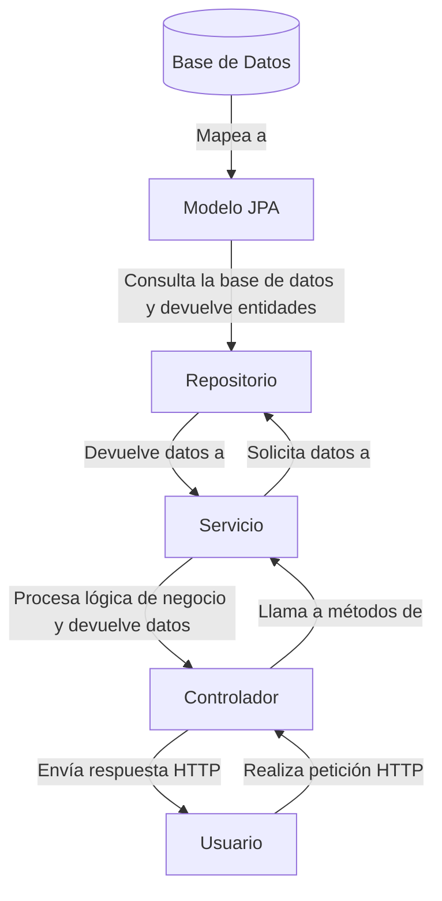

# Guía establecimiento de conexión a MySQL desde un proyecto Spring en Java, desplegado en Tomcat

Esta es una guía para configurar la conexión entre un proyecto Maven con Spring Java desplegado en el servidor Apache Tomcat con una base de datos MySQL en un servidor XAMPP en local.

> [!NOTE] La conexión a la base de datos varía entre IntelliJ IDEA Community e IntelliJ IDEA Ultimate.

> Por temas de "seguridad", XAMPP debe ser lanzado desde el usuario `C:\Users\User\Documents`.

## **1. Iniciar MySQL en XAMPP**

1. Abre **XAMPP Control Panel** (`xampp-control.exe`). E inicia **Apache** y luego **MySQL**.

2. Abre **phpMyAdmin** (`http://localhost/phpmyadmin`).

- Crea el usuario "2dawb", host-name "%" con contraseña "2daw2425" y otorga todos los privilegios.

```sql
CREATE USER '2dawb'@'%' IDENTIFIED VIA mysql_native_password USING '***';GRANT ALL PRIVILEGES ON *.* TO '2dawb'@'%' REQUIRE NONE WITH GRANT OPTION MAX_QUERIES_PER_HOUR 0 MAX_CONNECTIONS_PER_HOUR 0 MAX_UPDATES_PER_HOUR 0 MAX_USER_CONNECTIONS 0;GRANT ALL PRIVILEGES ON `2dawb\_%`.* TO '2dawb'@'%';
```

- Crea una base de datos llamada `animaldb` con `utf8mb4_spanish2_ci`.

```sql
-- Usar la base de datos
USE animaldb;

-- Crear la tabla Animal
CREATE TABLE Animal (
    Id INT AUTO_INCREMENT PRIMARY KEY,
    Nombre VARCHAR(15) NOT NULL,
    VidaMedia INT NOT NULL,
    Extinto BOOLEAN NOT NULL
);

-- Insertar algunos registros
INSERT INTO Animal (Nombre, VidaMedia, Extinto) VALUES
('Elefante', 70, FALSE),
('Dodo', 30, TRUE),
('Tortuga', 150, FALSE),
('Tigre', 25, FALSE),
('Mamut', 60, TRUE);
```

---

## **2. Crear un proyecto Java usando Spring**

### **Inicializar proyecto**

- Ve a [Spring Initializer](https://start.spring.io/) y usa los siguientes datos:

```
Project: Maven
Languages: Java
Spring Boot: 3.4.2
Group: es.cifpcm
Artifact: demoDB
Name: demo
Description: Demo project for Spring Boot
Package name: es.cifpcm.demdb
Dependencies: Spring Web, Spring Data JPA, Thymeleaf
```

Las dependencias utilizadas son:

- **Spring Web**: Para crear aplicaciones web RESTful.
- **Spring Data JPA**: Para la persistencia y comunicación con la base de datos.
- **Thymeleaf**: Motor de plantillas para generar vistas dinámicas en HTML.


### **Añadir propiedades**

Edita `src/main/resources/application.properties` y añade:

```txt
spring.application.name=gestion-recetas
spring.jpa.hibernate.ddl-auto=validate
spring.datasource.url=jdbc:mysql://${MYSQL_HOST:localhost}:3306/recetas
spring.datasource.username=2dawb
spring.datasource.password=2daw2425
spring.datasource.driver-class-name=com.mysql.cj.jdbc.Driver
spring.jpa.database-platform=org.hibernate.dialect.MySQLDialect
spring.jpa.hibernate.naming.physical-strategy=org.hibernate.boot.model.naming.PhysicalNamingStrategyStandardImpl
#server.servlet.context-path=/
hibernate.globally_quoted_identifiers=true
```

### **Añadir dependencias**

Si usas **Maven**, agrega estas dependencias en tu `pom.xml`:

```xml
<dependency>
    <groupId>com.mysql</groupId>
    <artifactId>mysql-connector-j</artifactId>
    <version>9.2.0</version>
</dependency>
<dependency>
    <groupId>org.projectlombok</groupId>
    <artifactId>lombok</artifactId>
    <version>1.18.36</version>
</dependency>

<dependency>
	<groupId>com.google.code.gson</groupdId>
	<artifactId>gson</artifactid>
	<version>2.12.1</version>
</dependency>
```

Si **no usas Maven**, descarga el `.jar` desde [aquí](https://mvnrepository.com/artifact/com.mysql/mysql-connector-j) y agrégalo a **File > Project Structure > Libraries** o a la ruta de la dependencia en tu sistema`C:\Users\d7\.m2\repository\com\mysql\mysql-connector-j\9.2.0`.

Se puede hacer `Alt+Insert` para mostrar el "buscador de artefactos de Maven", a partir del cual se pueden añadir.

![[maven-artifact-search.png]]

---

## **3. Conexión con la base de datos en IntelliJ**

### **Conexión en IntelliJ IDEA Community**

- Activa **JPA Explorer** (`View -> Tool Windows -> JPA Explorer`). 
- En **DB Connections**, haz clic derecho y selecciona "Add DB Connection".
  - Elige **MySQL 5**.
  - Ingresa `localhost`, el nombre de la base de datos, el usuario y la contraseña.
  - Prueba la conexión (`Test Connection`).
  - Descarga los drivers si es necesario.
- En **Persistence**, añade una nueva "Persistence Unit".
  - En la ventana "Create Persistence Unit", selecciona "Default DB Connection".

### **Conexión en IntelliJ IDEA Ultimate**

- Abre `View -> Tool Windows -> Database`. 
- Usa la siguiente URL de conexión:

      ```
      jdbc:mysql://localhost:3306/animaldb

  el caso, SmartTomcat debe estar mal configurado.

- Configura los drivers en la pestaña de `database`. 
- En el panel **Database**, verás la conexión activa con las tablas. 

---

## **4. Implementación del modelo en tres capas**

Este modelo de trabajo sigue la **Arquitectura en Tres Capas**:



### Opción para genear código automático con JPA

> [!NOTE] Recomendable tener creado los ("controller, model, data (repository, service)").

Clicamos botón derecho sobre el nombre del proyecto y hacer `New generate JPA Entity`. Si se auto-genera todo solo hace falta generar el servicio y el controlador.

> [!WARNING] Cambiar de `RestController` a `Controller`

![[setup-db-connection.png]]

![[auto-generation-settings.png]]

### **Modelo (Entity)**

> [!NOTE] El modelo se puede auto-generar mediante botón derecho sobre controller "Add new controller"

```java
@Entity
@Table(name = "animal")
@Data
public class Animal {
    @Id
    @GeneratedValue(strategy = GenerationType.IDENTITY)
    private Integer id;

    @Column(nullable = false)
    private String nombre;

    @Column(nullable = false)
    private Integer vidaMedia;

    @Column(nullable = false)
    private Boolean extinto;
}
```

### **Repositorio (Repository)**

```java
@Repository
public interface IAnimalRepository extends JpaRepository<Animal, Long> {
}
```

### **Servicio (Service Layer)**

```java
@Service
public class AnimalService {
    @Autowired
    private AnimalRepository animalRepository;

    public List<Animal> getAll() {
        return animalRepository.findAll();
    }
}
```

### **Controlador (Controller)**

```java
@Controller
public class AnimalController {
    @Autowired
    private AnimalService animalService;

    @GetMapping("/animales")
    public String listarAnimales(Model model) {
        List<Animal> lista = animalService.getAll();
        model.addAttribute("animales", lista);
        return "animales";
    }
}
```

### **Vista Thymeleaf (`src/main/resources/templates/animales.html`)**

```html
<!DOCTYPE html>
<html xmlns:th="http://www.thymeleaf.org">
  <head>
    <title>Lista de Animales</title>
  </head>
  <body>
    <h1>Lista de Animales</h1>
    <ul>
      <li th:each="animal : ${animales}" th:text="${animal.nombre}"></li>
    </ul>
  </body>
</html>
```

---

### Árbol de directorios

```sh
│   demoDB.iml
│   pom.xml
├───src
│   ├───main
│   │   ├───java
│   │   │   └───es
│   │   │       └───cifpcm
│   │   │           └───demodb
│   │   │               │   DemoDbApplication.java
│   │   │               │   ServletInitializer.java
│   │   │               ├───controller
│   │   │               │       AnimalController.java
│   │   │               ├───data
│   │   │               │   ├───repository
│   │   │               │   │       IAnimalRepository.java
│   │   │               │   └───service
│   │   │               │           AnimalServiceImpl.java
│   │   │               │           IAnimalService.java
│   │   │               └───model
│   │   │                       Animal.java
│   │   ├───resources
│   │   │   │   application.properties
│   │   │   ├───static
│   │   │   └───templates
│   │   │           animals.html
│   │   └───webapp
│   └───test
├───target
└───web
```

## **Referencias**

- [Spring Initializer](https://start.spring.io/)
- [Maven Repository](https://mvnrepository.com/)
- [JPA Intro - GeeksForGeeks](https://www.geeksforgeeks.org/jpa-introduction/)
