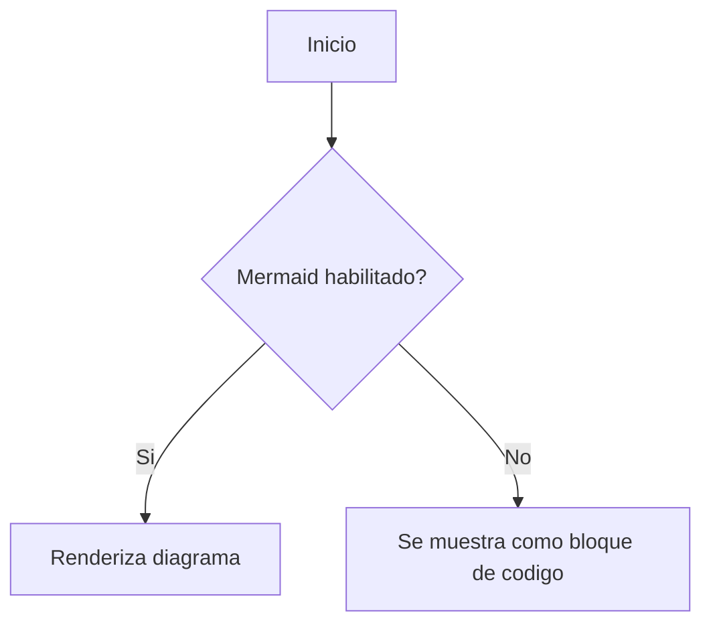

MD (Markdown) es un lenguaje de marcado ligero utilizado para formatear texto de manera sencilla y legible. Es ampliamente usado en documentación, blogs y archivos README.

## Características Principales

- Sintaxis simple y fácil de leer.
- Se puede convertir fácilmente a HTML.
- Soportado por diversas plataformas y herramientas como GitHub y Jupyter Notebook.

## Sintaxis Básica

Ejemplo de uso de Markdown:

```md
# Encabezado de nivel 1
## Encabezado de nivel 2

**Texto en negrita**
*Texto en cursiva*

[Enlace a Google](https://www.google.com)

- Elemento de lista 1
- Elemento de lista 2
```

## Mermaid en Quartz

Quartz soporta Mermaid, lo que permite agregar diagramas y graficos en tus notas Markdown.

- Esta compatibilidad viene integrada a traves del plugin `ObsidianFlavoredMarkdown`.
- Puedes habilitar o deshabilitar Mermaid desde la configuracion de ese plugin en `quartz.config.ts`.
- Mermaid soporta varios tipos de diagramas como flowcharts, sequence diagrams y timelines.
- Por defecto, Quartz renderiza Mermaid adaptando colores y estilos al tema del sitio.

Ejemplo:



> [!warning]
> Si los diagramas Mermaid no aparecen aunque esten habilitados, revisa el orden de plugins en `quartz.config.ts`.
> `ObsidianFlavoredMarkdown` debe estar despues de `SyntaxHighlighting`.

## Recursos Adicionales

- [Guía de Markdown en GitHub](https://guides.github.com/features/mastering-markdown/)
- [Daring Fireball - Markdown](https://daringfireball.net/projects/markdown/)
